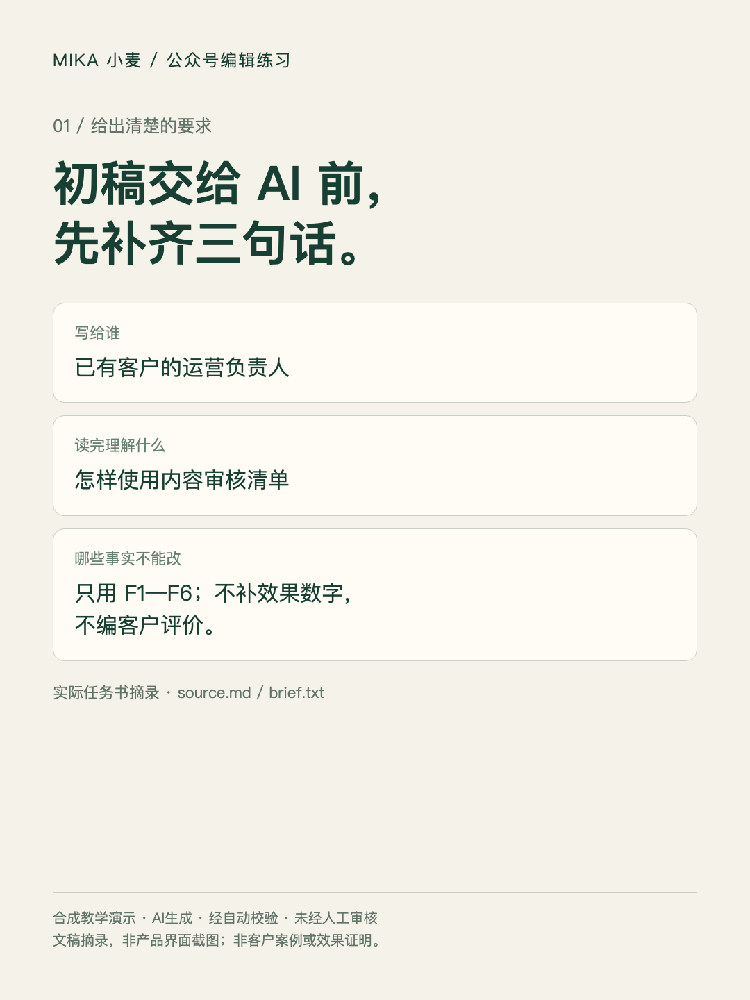
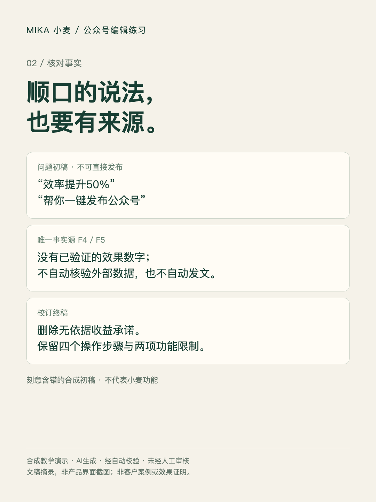
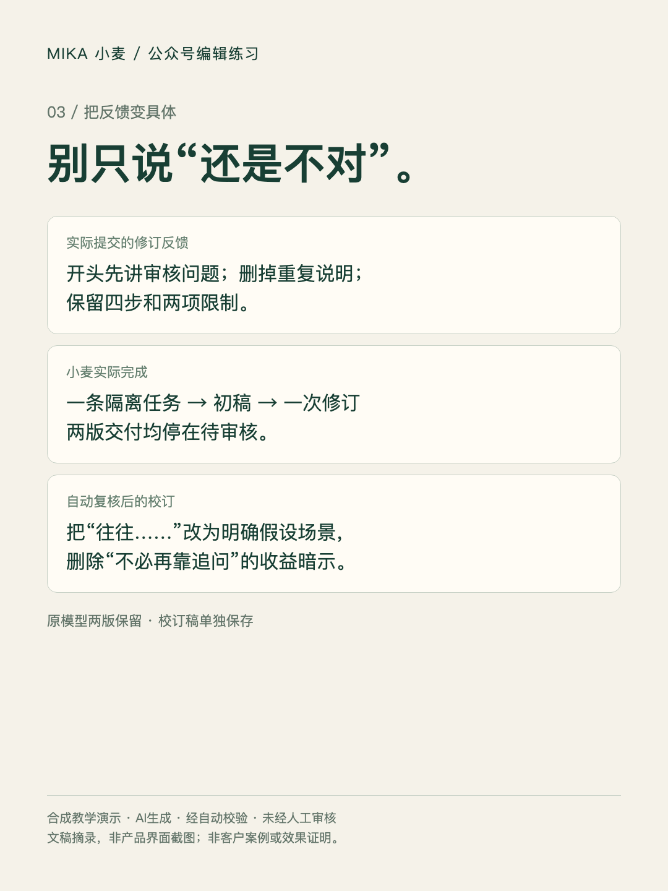

# 公众号初稿：从事实核对到一次具体修订

这是小麦维护者制作的合成教学演示。AI生成、经自动校验、未经人工审核；不是客户案例、效果测试或公众号发布记录。沿用现有 `wechat-article-editor` 能力，没有新增产品功能。

给 AI 初稿时，先写清三件事：文章给谁看、读完理解什么、哪些事实不能改。本例面向已有客户的运营负责人，解释虚构产品的审核清单；没有数字效果或客户评价的证据。

## 完整材料

1. [唯一事实源与问题初稿](source.md)：F1—F6，包含刻意设置的“效率提升50%”“自动发文”等错误说法。
2. [原始任务要求](brief.txt)与[第一版实际输出](mika-v1.md)。
3. [实际提交的一次修订反馈](revision-feedback.txt)与[第二版实际输出](mika-v2.md)。
4. [经Codex校订的可编辑终稿](edited-final.md)：与原始模型输出分开保存。
5. 下方文稿对照图：是上述文件的可视化摘录，不是工作台界面截图。

## 实际执行与校验边界

2026-10-02使用小麦当前本地任务服务及执行器、独立SQLite和合成身份，实际调用现有模型：一条任务、一次修订、两版待审核交付，9次模型调用，0次外网检索，未执行批准。没有写入生产账号、任务或增长统计，也没有发帖、发邮件或赠送额度。运行记录显示读取Skill、读取材料、报告进度和交付均完成；这不证明成果已经可用。

自动复核发现并处理了以下问题，模型内置“已检查”不作为验收证据：

- 原始输出笼统写“初稿未提及节时比例”，但初稿确有“效率提升50%”。编辑判断应是该数字无F1—F6支持，不能靠术语差别略过。
- 第二版“往往不是文笔问题”“不必再靠追问”缺少来源。终稿改为明确的假设场景，并删除必然收益暗示。
- 原始“约300字”是模型自报，不代表实测。终稿正文按汉字计数自动核验200—350字，保留四步与两项限制。
- 第一版的换行是字面转义，公开可读文件仅恢复转义；其余原文保持，已知问题没有偷偷覆盖。

终稿事实对应：受众F1；可记录字段与团队自行发布F2；四步F3；不自动核验/发文F4；未知信息F5；最后行动与无虚构产品链接F6。开头假设场景明确标出，未当作采访证据。原稿中的数字仅在问题材料或批注中展示，不能复用为宣传主张。

## 复制任务时替换这三句

> 这篇稿写给【读者】，希望读完理解【一个具体问题】。
> 只能使用【已授权资料】；无依据的数字和评价标待核实，不补写。
> 交付正文、修改说明、来源对应和待确认项；我会指出一次具体修改。

可先阅读[公众号编辑Skill](../../skills/wechat-article-editor/SKILL.md)。需要工作台时访问[小麦中文官网](https://mktskill.com/?utm_source=github&utm_medium=owned_demo&utm_campaign=wechat_edit_20261002)；注册、资格和额度以当时线上规则为准。本页不承诺曝光、节时或营销效果。

## English reader guide

This is a synthetic Chinese WeChat editing demonstration made by Mika's maintainer, not a customer case. AI-generated, automatically checked, not human-reviewed. The original brief, source facts, two actual isolated runner outputs, revision feedback, and a separately labeled Codex-edited final are linked above. The cards show document excerpts, not screenshots of the product.

The source deliberately includes unsupported efficiency claims and incorrect publishing capabilities. The final removes these claims, preserves four supplied steps and two limitations, and marks the opening scenario as hypothetical. Automated review also caught unsupported generalizations in the revised model output. No production users, approvals, external messages or growth results were created. This page demonstrates an editing workflow, not an English model run or a claim of customer satisfaction. For the existing capability, see the [English Skill page](https://mktskill.com/en/skills/wechat-article-editor/).
