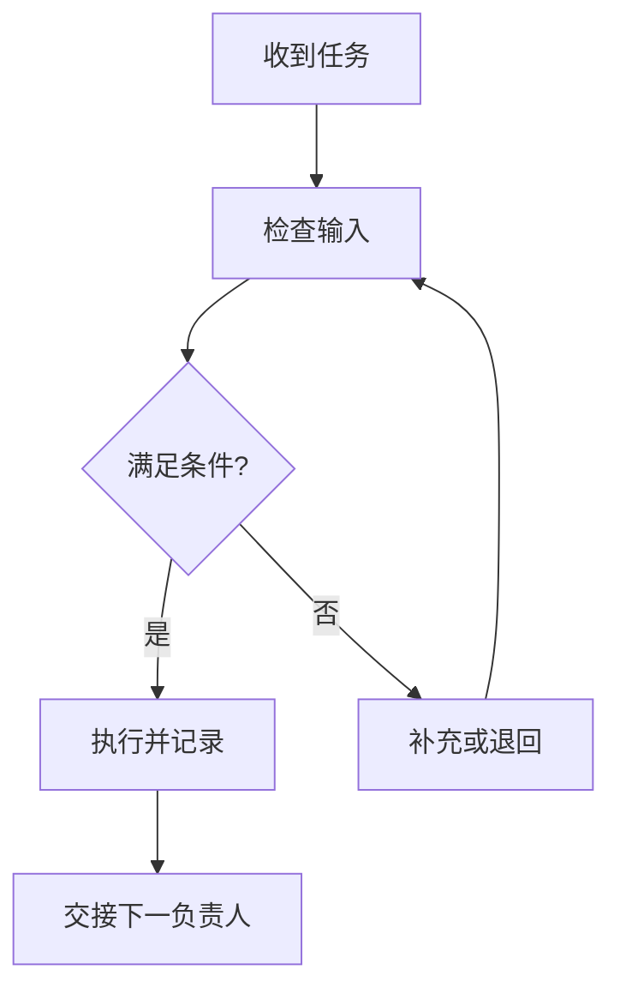

# SOP 流程图工作表

## 主路径

| 序号 | 负责人 | 输入 | 动作 | 输出 / 记录 | 下一步 |
|---|---|---|---|---|---|
|  |  |  |  |  |  |

## 决策规则

| 决策点 | 条件 | 是 | 否 | 例外 | SLA |
|---|---|---|---|---|---|
|  |  |  |  |  |  |

## Mermaid 骨架

## 交付检查

- 每条路径是否都有终点或回路条件？
- 是否标出负责人变化和记录要求？
- 图内规则与图外规则表是否一致？
- 一线人员能否只看图知道下一步？

